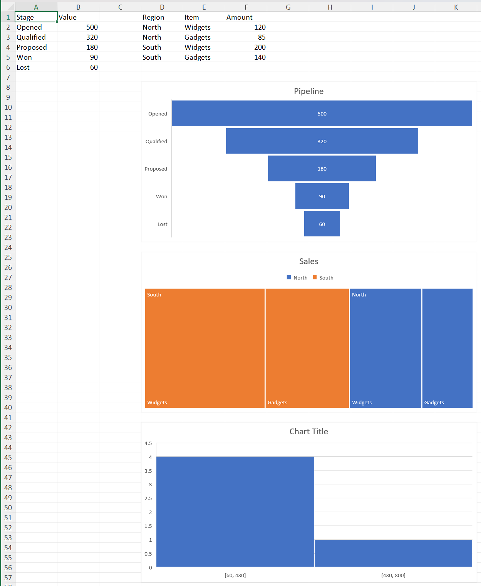

```@meta
CurrentModule = XLSX.Charts
```

!!! note "Experimental"

    Handling of native Excel charts in XLSX.jl is experimental and a work in 
    progress. All aspects may be subject to change. Feedback is welcome!


# Creating chartEx charts

```julia
julia> using XLSX, XLSX.Charts
```

The newer chart kinds live in Microsoft's `cx:` namespace and are created with
[`addChartEx`](@ref): `:waterfall`, `:funnel`, `:treemap`, `:sunburst`,
`:histogram`, `:pareto` and `:boxWhisker`. Reading them is covered in
[Reading charts](readingCharts.md), and the `c:` kinds in
[Creating charts](creatingCharts.md).

## Data comes first

A `cx:` chart part must contain data — the schema gives it no valid empty form —
so `addChartEx` takes the first series' values along with the kind:

```julia
julia> f = XLSX.newxlsx();

julia> ws = f[1];

julia> ws["A1"] = "Stage"; ws["B1"] = "Value";

julia> ws["A2:A6"] = reshape(["Opened", "Qualified", "Proposed", "Won", "Lost"], 5, 1);

julia> ws["B2:B6"] = reshape([500.0, 320.0, 180.0, 90.0, 60.0], 5, 1);

julia> c = addChartEx(ws, :funnel, "B2:B6"; categories = "A2:A6",
                      anchor = "D8:K23", title = "Pipeline")
XLSX.Charts.ChartEx "chartEx1" on sheet "Sheet1" at D2:K17
  title: "Pipeline"
  type: funnel
  layouts: funnel
  series: 1
  refs: Sheet1!$A$2:$A$6, Sheet1!$B$2:$B$6
```

That is the difference from [`addChart`](@ref), which creates an empty chart for
[`addSeries`](@ref) to fill.

`anchor`, `title`, `name`, `name_ref` and the reference forms are all as they
are for the `c:` kinds. Passing the file rather than a worksheet creates a
chartsheet, with `sheetname` in place of `anchor`.

## What each layout needs

`categories` means different things by layout, and the rules are enforced:

| Layout | Categories | Series |
| --- | --- | --- |
| `:waterfall` | optional | one |
| `:funnel` | optional | one |
| `:treemap` | **required**, one column per hierarchy level | one |
| `:sunburst` | **required**, one column per hierarchy level | one |
| `:histogram` | **none** — Excel bins the values itself | one |
| `:pareto` | optional | one |
| `:boxWhisker` | optional | several |

A treemap or sunburst takes its hierarchy from adjacent columns, outermost
first, passed as one range:

```julia
julia> ws["D1"] = "Region"; ws["E1"] = "Item"; ws["F1"] = "Amount";

julia> ws["D2:D5"] = reshape(["North", "North", "South", "South"], 4, 1);

julia> ws["E2:E5"] = reshape(["Widgets", "Gadgets", "Widgets", "Gadgets"], 4, 1);

julia> ws["F2:F5"] = reshape([120.0, 85.0, 200.0, 140.0], 4, 1);

julia> tm = addChartEx(ws, :treemap, "F2:F5"; categories = "D2:E5",
                       anchor = "D25:K40", title = "Sales")
XLSX.Charts.ChartEx "chartEx2" on sheet "Sheet1" at H2:O17
  title: "Sales"
  type: treemap
  layouts: treemap
  series: 1
  refs: Sheet1!$D$2:$E$5, Sheet1!$F$2:$F$5
```

A histogram takes no category at all, since Excel works out the bins from the values:

```julia
julia> h = addChartEx(ws, :histogram, "B2:B6"; anchor = "D42:K57")
XLSX.Charts.ChartEx "chartEx4" on sheet "Sheet1" at D42:K57
  type: histogram
  layouts: clusteredColumn
  series: 1
  refs: Sheet1!$B$2:$B$6
```
Binning is a property of the series rather than of the data — see
[`getSeriesBinning`](@ref) and [`setSeriesBinning`](@ref).



## Box and whisker: several series

`:boxWhisker` is the one layout that takes more than one series, added with
[`addSeries`](@ref) as for a `c:` chart:

```julia
julia> f = XLSX.newxlsx();

julia> ws = f[1];

julia> ws["A1"] = "Site"; ws["B1"] = "2024"; ws["C1"] = "2025";

julia> ws["A2:A6"] = reshape(["North", "South", "East", "West", "Central"], 5, 1);

julia> ws["B2:B6"] = reshape([12.0, 18.0, 9.0, 21.0, 15.0], 5, 1);

julia> ws["C2:C6"] = reshape([14.0, 16.0, 11.0, 19.0, 17.0], 5, 1);

julia> bw = addChartEx(ws, :boxWhisker, "B2:B6"; categories = "A2:A6",
                       anchor = "E2:L17", title = "Spread by site",
                       name_ref = "B1");

julia> addSeries(bw, "C2:C6"; categories = "A2:A6", name_ref = "C1");

julia> getChartSeriesCount(bw)
2
```

The two series share their categories, as Excel writes them. [`addSeries`](@ref) on a
[`ChartEx`](@ref) takes `categories`, `name` and `name_ref` only — the formatting
keywords of the `c:` form don't apply.

## No caches

A `cx:` chart carries references but no cached values: Excel writes none, and
neither does XLSX.jl. So a chart created this way shows nothing until Excel
opens the file and computes it, and [`getChartData`](@ref) throws for a
[`ChartEx`](@ref).

The references themselves are written as hidden defined names of the form
`_xlchart.v1.0`, which is how Excel does it.
[`getChartRanges`](@ref) resolves them back to ranges.

## Appearance

A created `cx:` chart gets Excel's own style for that layout. Most of a `cx:`
chart's appearance lives in its style part rather than in the chart part, and
that part is not read into the cascade — so formatting a `cx:` chart from code
reaches less than it does for a `c:` chart. See
[Limitations](chartLimitations.md).

Region maps cannot be created: Excel resolves their geography through an online
service, and the package has no template for one. They are read like any other
[`ChartEx`](@ref).
