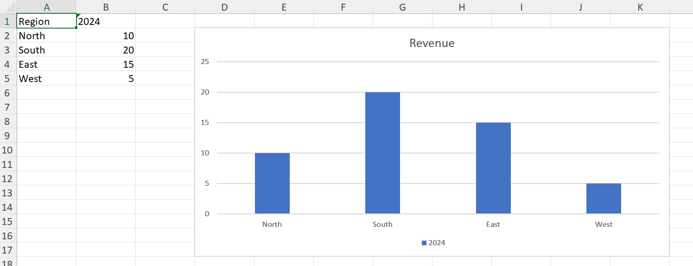
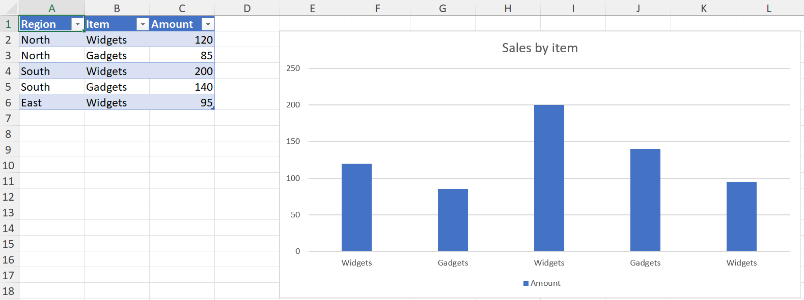

```@meta
CurrentModule = XLSX.Charts
```

!!! note "Experimental"

    Handling of native Excel charts in XLSX.jl is experimental and a work in 
    progress. All aspects may be subject to change. Feedback is welcome!


# Creating charts

```julia
julia> using XLSX, XLSX.Charts
```

[`addChart`](@ref) makes an empty chart of a given kind, and
[`addSeries`](@ref) fills it. This page covers the `c:` schema; the newer kinds
are in [Creating chartEx charts](creatingChartEx.md).

## A chart on a worksheet

```julia
julia> f = XLSX.newxlsx();

julia> ws = f[1];

julia> ws["A1"] = "Region"; ws["B1"] = "2024";

julia> ws["A2:A5"] = reshape(["North", "South", "East", "West"], 4, 1);

julia> ws["B2:B5"] = reshape([10.0, 20.0, 15.0, 5.0], 4, 1);

julia> c = addChart(ws, :column; anchor = "D2:K17", title = "Revenue");

julia> addSeries(c, "B2:B5"; categories = "A2:A5", name_ref = "B1");

julia> XLSX.writexlsx("revenue.xlsx", f)
```



`anchor` is required, and is the cell range the chart covers — its top-left and
bottom-right corners on the sheet. `title` is `nothing` for the title Excel
generates itself, a string for typed text, or `false` for no title at all.

A chart is created empty because a `c:` chart part is valid with no series, so
`addChart` and `addSeries` can be separate steps. That is not true of the `cx:`
schema, where the data block is required.

## The kinds

`kind` is one of `:column`, `:bar`, `:stackedColumn`, `:line`, `:lineMarkers`,
`:area`, `:pie`, `:doughnut`, `:scatter`, `:bubble` or `:radar`.

Each comes from a chart part Excel itself wrote, kept verbatim in the package,
so a created chart is what Excel would have produced for that kind — including
its style and colour parts. Kinds with no template yet throw rather than
approximate; see [Limitations](chartLimitations.md).

## A chart on its own sheet

Pass the file rather than a worksheet to create a chartsheet:

```julia
julia> cs = addChart(f, :line; sheetname = "Trend", title = "Revenue over time");
```

`sheetname` defaults to `Chart1`, `Chart2`, … as Excel names them. A chartsheet
holds one chart, positioned absolutely rather than anchored to cells, so there
is no `anchor` to give.

Its series still take their data from a worksheet, and must name the sheet,
since there is no sheet of its own for an unqualified range to mean:

```julia
julia> addSeries(cs, "Sheet1!B2:B5"; categories = "Sheet1!A2:A5");
```

## Referring to data

A series' `values`, `categories`, `name_ref` and `bubble_sizes` all take the
same forms:

- A range string — `"B2:B5"`, or `"Sheet1!B2:B5"` to name the sheet. An
  unqualified range means the chart's own sheet.
- A defined name, which resolves through the workbook.
- A reference object: `XLSX.SheetCellRange`, `XLSX.CellRange` and the rest of
  the range types.

For a table, [`XLSX.gettablerange`](@ref) gives the ranges, header cell
included:

```julia
julia> ts = XLSX.addsheet!(f, "Sales");

julia> ts["A1"] = "Region"; ts["B1"] = "Item"; ts["C1"] = "Amount";

julia> ts["A2:A6"] = reshape(["North", "North", "South", "South", "East"], 5, 1);

julia> ts["B2:B6"] = reshape(["Widgets", "Gadgets", "Widgets", "Gadgets", "Widgets"], 5, 1);

julia> ts["C2:C6"] = reshape([120.0, 85.0, 200.0, 140.0, 95.0], 5, 1);

julia> t = XLSX.addtable!(ts, "A1:C6"; name = "Sales", style="TableStyleMedium2");

julia> tc = addChart(ts, :column; anchor = "E2:L18", title = "Sales by item");

julia> addSeries(tc, XLSX.gettablerange(t, "Amount");
                 categories = XLSX.gettablerange(t, "Item"),
                 name_ref = XLSX.gettablerange(t, "Amount"; header = true));

julia> only(getChartSeries(tc)).name
"Amount"
```



Whatever you pass, the chart part stores a sheet-qualified absolute reference,
as Excel does. The cells' current values are cached in the chart at the same
time, so the series reads back without opening the file in Excel — see
[the chart cache](readingCharts.md#The-chart-cache).

`name` and `name_ref` differ: `name` is the series name as literal text, while
`name_ref` points at a cell holding it, which is what Excel writes when you
select a header row. Pass one or neither, not both.

## Series options

[`addSeries`](@ref) takes the common formatting inline, so a series can be
styled as it is added rather than in a second pass:

```julia
julia> addSeries(c, "C2:C5"; categories = "A2:A5", name = "2025", color = "FF0000");
```

| Keyword | Applies to | Takes |
| --- | --- | --- |
| `color` | everything but pie and doughnut | a colour name, hex, a `Colorant`, a [`SchemeColor`](@ref), or a scheme name such as `"accent4"` |
| `markers` | line, lineMarkers, radar, scatter | a symbol such as `:circle`, or `false` for none |
| `smooth` | line, lineMarkers, scatter | `true` or `false` — whether the line is curved |
| `line` | scatter | `true` to join the points |

An option that doesn't apply to the chart's kind throws rather than being
ignored, so a mistake is caught rather than silently dropped. Pie and doughnut
charts colour their points individually rather than by series, which is why
`color` has no meaning there.

Without `color`, series take the theme's accent colours in turn, as Excel does.
Anything not covered here is set afterwards with the functions in
[Formatting charts](formattingCharts.md).

A few combinations are rejected because the result would draw nothing or is
under-specified: a bubble series needs both `categories` (its X values) and
`bubble_sizes`, and a scatter series with `markers = false` needs `line = true`.

## Adding to a chart Excel made

[`addSeries`](@ref) reads the chart's kind back from the part rather than from anything
the package recorded, so it works on a chart Excel created exactly as on one
[`addChart`](@ref) made:

```julia
julia> g = XLSX.opentemplate("chart_basic.xlsx");

julia> ec = getCharts(g)[1]
XLSX.Charts.Chart "chart1" on sheet "Data" at G9:N23
  title: "Revenue by Region"
  type: barChart
  series: 2
    [1] 2024 - Data!$B$2:$B$5 (4 pts)
    [2] 2025 - Data!$C$2:$C$5 (4 pts)


julia> addSeries(ec, "Data!D2:D5"; categories = "Data!A2:A5", name = "2026");

julia> ec
XLSX.Charts.Chart "chart1" on sheet "Data" at G9:N23
  title: "Revenue by Region"
  type: barChart
  series: 3
    [1] 2024 - Data!$B$2:$B$5 (4 pts)
    [2] 2025 - Data!$C$2:$C$5 (4 pts)
    [3] 2026 - Data!$D$2:$D$5 (4 pts)
```

The new series takes the next accent colour and the chart's own style, so it
looks like the ones already there.

```julia

julia> [getSeriesFill(ec, i).value.fgcolor.val for i in 1:3]
3-element Vector{String}:
 "accent1"
 "accent2"
 "accent3"
 ```

A chart with more than one group — a combo chart — has no single group to add
to, so `addSeries` throws on one.

## Themes

A created chart's colours are theme references, not fixed values, so the chart
follows the workbook's theme the way Excel's own charts do.

One consequence worth knowing: a workbook from [`XLSX.newxlsx()`](@ref) carries an older
Office theme than current Excel, so charts created in a new workbook show that
theme's colours rather than the ones Excel 365 would use. A chart added to a
workbook Excel created uses that workbook's theme and matches.
