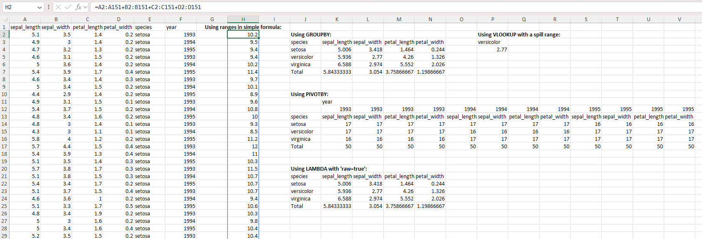
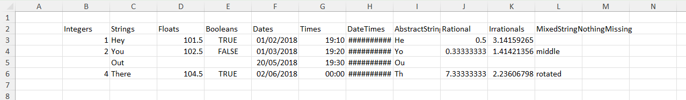
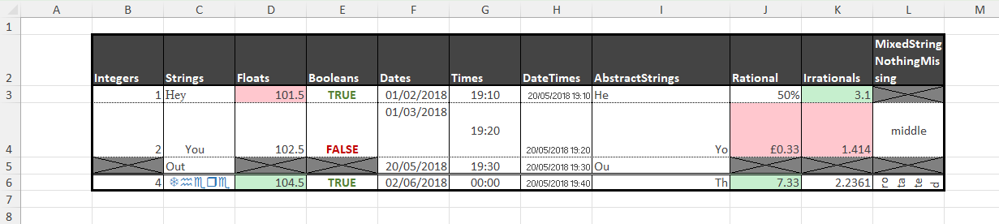
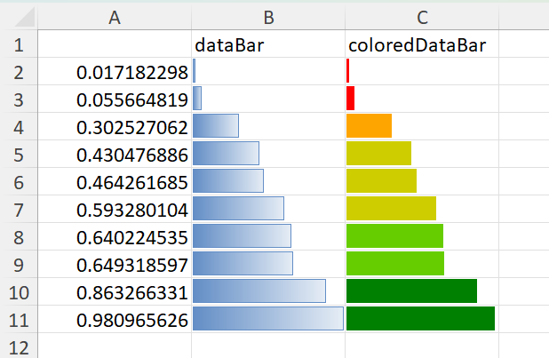
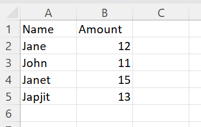
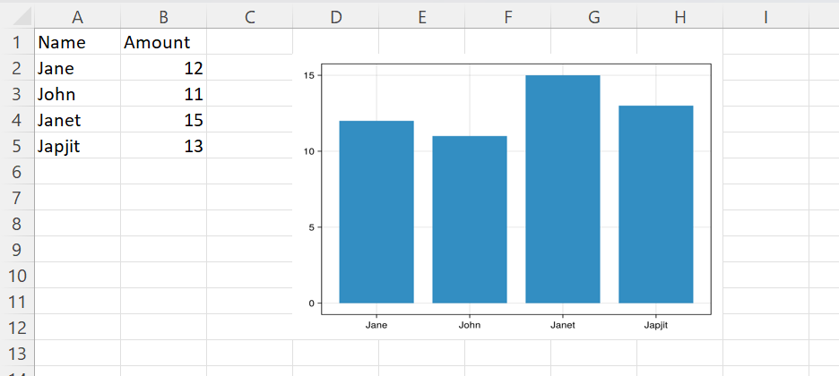
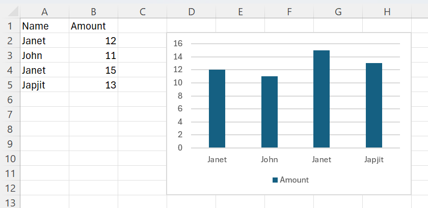
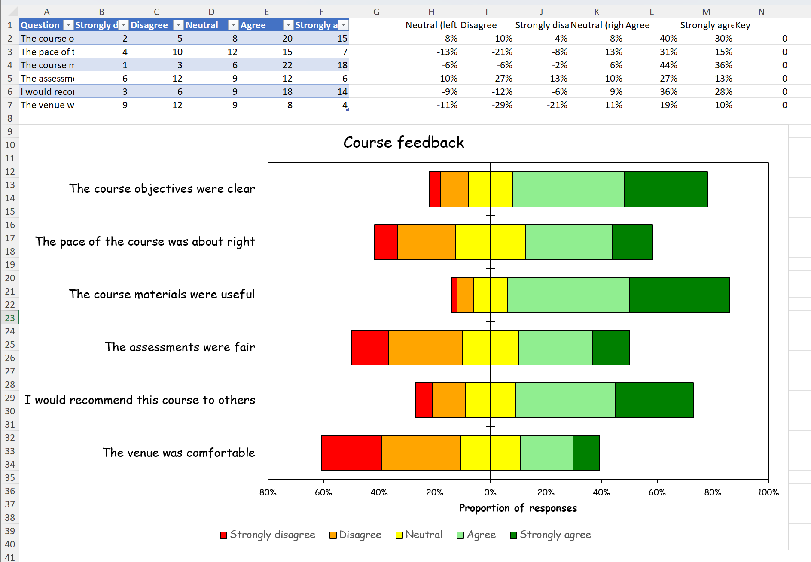

# Examples

## Applying formulas

Using the widely used [Iris data set](https://archive.ics.uci.edu/dataset/53/iris):

```julia

using CSV
using DataFrames
using XLSX

f = CSV.read("iris.csv", XLSXFile)
f[1][1, 6]="year" # arbitrary data column for aggregation purposes
f[1][2:3:151, 6]=1993
f[1][3:3:151, 6]=1994
f[1][4:3:151, 6]=1995
XLSX.setFormula(f[1], "J3", "=GROUPBY(E1:E151,A1:D151,AVERAGE,3,1)")
f[1]["P3"] = "versicolor"
XLSX.setFormula(f[1], "P4", "=VLOOKUP(P3,J3#,3,FALSE)")
XLSX.setFormula(f[1], "J11", "=PIVOTBY(E1:E151,F1:F151,A1:D151,COUNT,3,1,,0)")
XLSX.setFormula(f[1], "J21", "_xlfn.GROUPBY(E1:E151,A1:D151,_xlfn.LAMBDA(_xlpm.x,AVERAGE(_xlpm.x)),3,1)"; raw=true)
XLSX.setFormula(f[1], "H2", "=A2:A151+B2:B151+C2:C151+D2:D151")

f[1]["H1"] = "Using ranges in simple formula:"
f[1]["J2"] = "Using GROUPBY:"
f[1]["P2"] = "Using VLOOKUP with a spill range:"
f[1]["J10"] = "Using PIVOTBY:"
f[1]["J20"] = "Using LAMBDA with 'raw=true':"
setFont(f[1], "H1,J2,P2,J10,J20"; size=12, bold=true)
setAlignment(f[1], "H1"; horizontal="center")

```



## Applying cell format to an existing table

Consider a simple table, created from scratch, like this:

```julia
using XLSX
using Dates

# First create some data in an empty XLSXfile
xf = XLSX.newxlsx()
sheet = xf["Sheet1"]

col_names = ["Integers", "Strings", "Floats", "Booleans", "Dates", "Times", "DateTimes", "AbstractStrings", "Rational", "Irrationals", "MixedStringNothingMissing"]
data = Vector{Any}(undef, 11)
data[1] = [1, 2, missing, UInt8(4)]
data[2] = ["Hey", "You", "Out", "There"]
data[3] = [101.5, 102.5, missing, 104.5]
data[4] = [true, false, missing, true]
data[5] = [Date(2018, 2, 1), Date(2018, 3, 1), Date(2018, 5, 20), Date(2018, 6, 2)]
data[6] = [Dates.Time(19, 10), Dates.Time(19, 20), Dates.Time(19, 30), Dates.Time(0, 0)]
data[7] = [Dates.DateTime(2018, 5, 20, 19, 10), Dates.DateTime(2018, 5, 20, 19, 20), Dates.DateTime(2018, 5, 20, 19, 30), Dates.DateTime(2018, 5, 20, 19, 40)]
data[8] = SubString.(["Hey", "You", "Out", "There"], 1, 2)
data[9] = [1 // 2, 1 // 3, missing, 22 // 3]
data[10] = [pi, sqrt(2), missing, sqrt(5)]
data[11] = [nothing, "middle", missing, "rotated"]

XLSX.writetable!(
    sheet,
    data,
    col_names;
    anchor_cell=XLSX.CellRef("B2"),
    write_columnnames=true,
)

XLSX.writexlsx("mytable_unformatted.xlsx", xf, overwrite=true)
```

By default, this table will look like this in Excel:



We can apply some formatting choices to change the table's appearance:



This is achieved with the following code:

```julia
# Cell borders
XLSX.setUniformBorder(sheet, "B2:L6";
    top    = ["style" => "hair", "color" => "FF000000"],
    bottom = ["style" => "hair", "color" => "FF000000"],
    left   = ["style" => "thin", "color" => "FF000000"],
    right  = ["style" => "thin", "color" => "FF000000"]
)
XLSX.setBorder(sheet, "B2:L2"; bottom = ["style" => "medium", "color" => "FF000000"]) 
XLSX.setBorder(sheet, "B6:L6"; top = ["style" => "double", "color" => "FF000000"])
XLSX.setOutsideBorder(sheet, "B2:L6"; outside = ["style" => "thick", "color" => "FF000000"])

# Cell fill
XLSX.setFill(sheet, "B2:L2"; pattern = "solid", fgColor = "FF444444")

# Cell fonts
XLSX.setFont(sheet, "B2:L2"; bold=true, color = "FFFFFFFF")
XLSX.setFont(sheet, "B3:L6"; color = "FF444444")
XLSX.setFont(sheet, "C3"; name = "Times New Roman")
XLSX.setFont(sheet, "C6"; name = "Wingdings", color = "FF2F75B5")

# Cell alignment
XLSX.setAlignment(sheet, "L2"; wrapText = true)
XLSX.setAlignment(sheet, "I4"; horizontal="right")
XLSX.setAlignment(sheet, "I6"; horizontal="right")
XLSX.setAlignment(sheet, "C4"; indent=2)
XLSX.setAlignment(sheet, "F4"; vertical="top")
XLSX.setAlignment(sheet, "G4"; vertical="center")
XLSX.setAlignment(sheet, "L4"; horizontal="center", vertical="center")
XLSX.setAlignment(sheet, "G3:G6"; horizontal = "center")
XLSX.setAlignment(sheet, "H3:H6"; shrink = true)
XLSX.setAlignment(sheet, "L6"; horizontal = "center", rotation = 90, wrapText=true)

# Row height and column width
XLSX.setRowHeight(sheet, "B4"; height=50)
XLSX.setRowHeight(sheet, "B6"; height=15)
XLSX.setColumnWidth(sheet, "I"; width = 20.5)

# Conditional formatting
function blankmissing(sheet, rng) # Fill with grey and apply both diagonal borders on cells
    for c in rng                  # with missing values
        if ismissing(sheet[c])
            XLSX.setFill(sheet, c; pattern = "solid", fgColor = "grey")
            XLSX.setBorder(sheet, c; diagonal = ["style" => "thin", "color" => "black"])
           end
    end
end
function trueorfalse(sheet, rng) # Use green or red font for true or false respectively
    for c in rng
        if !ismissing(sheet[c]) && sheet[c] isa Bool
            XLSX.setFont(sheet, c, bold=true, color = sheet[c] ? "FF548235" : "FFC00000")
        end
    end
end
function redgreenminmax(sheet, rng) # Fill light green / light red the cell with maximum / minimum value
    mn, mx = extrema(x for x in sheet[rng] if !ismissing(x))
    for c in rng
        if !ismissing(sheet[c])
            if sheet[c] == mx
               XLSX.setFill(sheet, c; pattern = "solid", fgColor = "FFC6EFCE")
            elseif sheet[c] == mn
                XLSX.setFill(sheet, c; pattern = "solid", fgColor = "FFFFC7CE")
            end
        end
    end
end

blankmissing(sheet, XLSX.CellRange("B3:L6"))
trueorfalse(sheet, XLSX.CellRange("B2:L6"))
redgreenminmax(sheet, XLSX.CellRange("D3:D6"))
redgreenminmax(sheet, XLSX.CellRange("J3:J6"))
redgreenminmax(sheet, XLSX.CellRange("K3:K6"))

# Number formats
XLSX.setFormat(sheet, "J3"; format = "Percentage")
XLSX.setFormat(sheet, "J4"; format = "Currency")
XLSX.setFormat(sheet, "J6"; format = "Number")
XLSX.setFormat(sheet, "K3"; format = "0.0")
XLSX.setFormat(sheet, "K4"; format = "0.000")
XLSX.setFormat(sheet, "K6"; format = "0.0000")

# Save to an actual XLSX file
XLSX.writexlsx("mytable_formatted.xlsx", xf, overwrite=true)
```

## Creating a formatted form

There is a file, customXml.xlsx, in the \data folder of this project that looks like a template 
file - a form to be filled in. The code below creates this form from scratch and makes 
extensive use of vector indexing for rows and columns and of non-contiguous ranges:

```julia
using XLSX

f = XLSX.newxlsx()
s = f[1]
s["A1:K116"] = ""

s["B2"] = "Catalogue Entry Form"

s["B5"] = "User Data"
s["B7"] = "Recipient ID"
s["B9"] = "Recipient Name"
s["B11"] = "Address 1"
s["B12"] = "Address 2"
s["B13"] = "Address 3"
s["B14"] = "Town"
s["B16"] = "Postcode"
s["B18"] = "Ward"
s["B20"] = "Region"
s["H18"] = "Local Authority"
s["H20"] = "UK Constituency"
s["B22"] = "GrantID"
s["D22"] = "Grant Date"
s["F22"] = "Grant Amount"
s["H22"] = "Grant Title"
s["J22"] = "Distributor"
s["B32"] = "Distributor"

s["B30"] = "Creator"
s["B34"] = "Created by"
s["D36"] = "Email"
s["H36"] = "Phone"
s["B38"] = "Grant Manager"
s["D40"] = "Email"
s["H40"] = "Phone number"

s["B43"] = "Summary"
s["B45"] = "Summary ID"
s["H45"] = "Date Created"
s["B47"] = "Summary Name"
s["B49"] = "Headline"
s["B51"] = "Short Description"
s["B55"] = "Long Description"
s["B62"] = "Quote 1"
s["D65"] = "Quote Attribution"
s["H65"] = "Quote Date"
s["B67"] = "Quote 2"
s["D70"] = "Quote Attribution"
s["H70"] = "Quote Date"
s["B72"] = "Keywords"
s["B74"] = "Website"
s["B76"] = "Social media handles"
s["D76"] = "Twitter"
s["D78"] = "Facebook"
s["D80"] = "Instagram"
s["H76"] = "LinkedIn"
s["H78"] = "TikTok"
s["H80"] = "YouTube"
s["B82"] = "Image 1 filename"
s["D84"] = "Alt-Text"
s["D86"] = "Image Attribution"
s["D88"] = "Image Date"
s["D90"] = "Confirm permission to use image"
s["B92"] = "Image 2 filename"
s["D94"] = "Alt-Text"
s["D96"] = "Image Attribution"
s["D98"] = "Image Date"
s["D100"] = "Confirm permission to use image"

s["B103"] = "Penultimate category"
s["B105"] = "Competition Details"
s["D105"] = "Last year of entry"
s["D107"] = "Year of last win"
s["H105"] = "Categories of entry"
s["H107"] = "Categories of win"

s["B110"] = "Last category"
s["B112"] = "Use for Comms"
s["D112"] = "Comms Priority"
s["F112"] = "Comms End Date"

XLSX.setColumnWidth(s, 1:2:11; width=1.3)
XLSX.setColumnWidth(s, 2:2:10; width=18)
XLSX.setRowHeight(s, :; height=15)
XLSX.setRowHeight(s, [3, 4, 19, 28, 29, 35, 39, 41, 42, 64, 69, 77, 79, 83, 85, 87, 89, 93, 95, 97, 99, 101, 102, 106, 108, 109, 116]; height=5.5)
XLSX.setRowHeight(s, [5, 30, 43, 103, 110]; height=18)
XLSX.setRowHeight(s, 2; height=23)

XLSX.setFont(s, "B2"; size=18, bold=true)
XLSX.setUniformFont(s, [5, 30, 43, 103, 110], 2; size=14, bold=true)

XLSX.setUniformFill(s, [1, 2, 3, 4, 5, 6, 8, 10, 15, 17, 19, 21, 28, 29, 30, 31, 33, 35, 37, 39, 41, 42, 43, 44, 46, 48, 50, 52, 53, 54, 56, 57, 58, 59, 60, 61, 63, 64, 66, 68, 69, 71, 73, 75, 77, 79, 81, 83, 85, 87, 89, 91, 93, 95, 97, 99, 101, 102, 103, 104, 106, 108, 109, 110, 111, 115, 116], :; pattern="solid", fgColor="lightgrey")
XLSX.setUniformFill(s, :, [1, 3, 5, 7, 9, 11]; pattern="solid", fgColor="lightgrey")
XLSX.setFill(s, "F7,H7,J7,J9,H11:J16,F14,F16:F20,H32:J32,B36,B40,F45,J47:J49,B65,B70,B78:B80,B84:B90,B94:B100,H88:J90,H98:J100,B107,F114,H112:J115"; pattern="solid", fgColor="lightgrey")
XLSX.setFill(s, "D18,D20,J18,J20,D45"; pattern="solid", fgColor="darkgrey")
XLSX.setFill(s, "B112:B114,D112:D115"; pattern="solid", fgColor="white")
XLSX.setFill(s, "E90,E100,D115"; pattern="none")

XLSX.mergeCells(s, "D9:H9")
XLSX.mergeCells(s, "D11:G11,D12:G12,D13:G13")
XLSX.mergeCells(s, "D32:F32,D34:J34,D38:J38")
XLSX.mergeCells(s, "D47:H47,D49:H49")
XLSX.mergeCells(s, "D51:J53,D55:J60")
XLSX.mergeCells(s, "D62:J63,D67:J68")
XLSX.mergeCells(s, "D72:J72,D74:J74")
XLSX.mergeCells(s, "D82:J82,F84:J84,F86:J86")
XLSX.mergeCells(s, "D92:J92,F94:J94,F96:J96")

XLSX.setAlignment(s, "D51:J53,D55:J60,D62:J63,D67:J68"; vertical="top", wrapText=true)

XLSX.setBorder(s, "A1:K3"; outside = ["style" => "medium", "color" => "black"])
XLSX.setBorder(s, "A4:K28"; outside = ["style" => "medium", "color" => "black"])
XLSX.setBorder(s, "A29:K41"; outside = ["style" => "medium", "color" => "black"])
XLSX.setBorder(s, "A42:K101"; outside = ["style" => "medium", "color" => "black"])
XLSX.setBorder(s, "A102:K108"; outside = ["style" => "medium", "color" => "black"])
XLSX.setBorder(s, "A109:K116"; outside = ["style" => "medium", "color" => "black"])

XLSX.setBorder(s, "B7:D7,B9:H9"; allsides = ["style" => "thin", "color" => "black"])
XLSX.setBorder(s, "B11:G13,B14:D14,B16:D16"; allsides = ["style" => "thin", "color" => "black"])
XLSX.setBorder(s, "B18:D18,B20:D20,H18:J18,H20:J20"; allsides = ["style" => "thin", "color" => "black"])
XLSX.setUniformBorder(s, "B22:J27"; allsides = ["style" => "thin", "color" => "black"])

XLSX.setBorder(s, "B32:F32"; allsides = ["style" => "thin", "color" => "black"])
XLSX.setBorder(s, "B34:C34,D34:J34,D36:F36,H36:J36"; allsides = ["style" => "thin", "color" => "black"])
XLSX.setBorder(s, "B38:C38,D38:J38,D40:F40,H40:J40"; allsides = ["style" => "thin", "color" => "black"])
XLSX.setBorder(s, "D34:J36,D38:J40"; outside = ["style" => "thin", "color" => "black"])

XLSX.setBorder(s, "B45:D45,H45:J45"; allsides = ["style" => "thin", "color" => "black"])
XLSX.setBorder(s, "B47:H47,B49:H49"; allsides = ["style" => "thin", "color" => "black"])
XLSX.setBorder(s, "B51:C51,B55:C55"; allsides = ["style" => "thin", "color" => "black"])
XLSX.setBorder(s, "D51:J53,D55:J60"; outside = ["style" => "thin", "color" => "black"])

XLSX.setBorder(s, "B62:C62,D65:F65,H65:J65"; allsides = ["style" => "thin", "color" => "black"])
XLSX.setBorder(s, "B67:C67,D70:F70,H70:J70"; allsides = ["style" => "thin", "color" => "black"])
XLSX.setBorder(s, "D62:J63,D67:J68"; allsides = ["style" => "thin", "color" => "black"])
XLSX.setBorder(s, "D62:J65,D67:J70"; outside = ["style" => "thin", "color" => "black"])

XLSX.setBorder(s, "B72:J72,B74:J74"; allsides = ["style" => "thin", "color" => "black"])

XLSX.setBorder(s, "B76:F76,H76:J76,D78:F78,H78:J78,D80:F80,H80:J80"; allsides = ["style" => "thin", "color" => "black"])
XLSX.setBorder(s, "D76:J80"; outside = ["style" => "thin", "color" => "black"])

XLSX.setBorder(s, "B82:J82,D84:J84,D86:J86,D88:F88,D90:F90"; allsides = ["style" => "thin", "color" => "black"])
XLSX.setBorder(s, "D82:J90"; outside = ["style" => "thin", "color" => "black"])
XLSX.setBorder(s, "B92:J92,D94:J94,D96:J96,D98:F98,D100:F100"; allsides = ["style" => "thin", "color" => "black"])
XLSX.setBorder(s, "D92:J100"; outside = ["style" => "thin", "color" => "black"])

XLSX.setBorder(s, "B105:F105,H105:J105,D107:F107,H107:J107"; allsides = ["style" => "thin", "color" => "black"])
XLSX.setBorder(s, "D105:J107"; outside = ["style" => "thin", "color" => "black"])

XLSX.setBorder(s, "F112,F113"; allsides = ["style" => "thin", "color" => "black"])
XLSX.setBorder(s, "B112:B114,D112:D115"; outside = ["style" => "thin", "color" => "black"])

XLSX.writexlsx("myNewTemplate.xlsx", f, overwrite=true)
```

## Adding a dataBar with varying colors

Excel's databar conditional format have a fixed color. The bar length 
changes with the cell value but the color doesn't. The function `setColoredDataBars`
provides a pragmatic workaround to make this possible in XLSX.

```
xf = newxlsx()
s=xf[1]
s["B1"] = "dataBar"
s["C1"] = "coloredDataBar"
s["A2:A11"] = sort!(rand(10))
s["B2:B11"] = s["A2:A11"]
s["C2:C11"] = s["A2:A11"]
setConditionalFormat(s, "B2:B11", :dataBar; showVal="false")
XLSX.setColoredDataBars(s, "C2:C11"; 
    bands=5, 
    min_val="0", 
    max_val="1",
    breaks=[0.2, 0.4, 0.6, 0.8],
    colors=[:red, :orange, :yellow3, :chartreuse3, :green], 
    showVal="false")
writexlsx("coloredDataBar.xlsx", xf)
```



This function uses the native databar conditional format, but it partitions the range 
supplied based on cell values and applies different databars of different colors to 
each partition at the time the function is called. If the data subsequently change,
the bar lengths will allways change but the colors won't, and so become misleading.
This function therefore behaves like a static conditional format.

!!! note

    `setColoredDataBars` requires cells to contain values. If cells contain formulas
    written by `setFormula`, there values will be set to missing but will be recalculated
    when the resulting file is opened by Excel. Until such a recalculation by Excel 
    happens, `setColoredDataBars cannot work:

    ```julia
    xf = newxlsx()
    s=xf[1]
    s["A2:A11"] = sort!(rand(10))
    setFormula(s, "B2:B11", "=A1") # setting a formula sets values to missing
    setFormula(s, "C2:C11", "=A1") # values are are only populated when Excel recalculates
    setConditionalFormat(s, "B2:B11", :dataBar; showVal="false") # works as it does not depend on cell contents
    XLSX.setColoredDataBars(s, "C2:C11"; # fails
        bands=5, 
        min_val="0", 
        max_val="1",
        breaks=[0.2, 0.4, 0.6, 0.8],
        colors=[:red, :orange, :yellow3, :chartreuse3, :green], 
        showVal="false")
    ERROR: XLSXError: No numeric values in `C2:C11` to band.
    ```

!!! note

    This function is provided on an experimental basis and isn't public. It may be withdrawn 
    in future and only remain here (more fully documented) as an example.

## Adding a plot image

Use Julia functionality to create a chart based upon data from a spreadsheet and then add that chart 
(as a static image) back into the worksheet.



```julia
using CairoMakie, XLSX

f=opentemplate("Example_add_chart.xlsx")
table = XLSX.gettable(f[1])
x = 1:length(table.data[1])

fig = Figure()
ax = Axis(fig[1, 1], xticks=(x, table.data[1]))
barplot!(ax, x, table.data[2])

# Write PNG to IOBuffer
io = IOBuffer()
show(io, MIME("image/png"), fig)

XLSX.addImage(f[1], "D2:H12", io)

XLSX.writexlsx("Example_add_chart_out.xlsx", f, overwrite=true)
```



## Adding a simple native Excel chart

The same plot as a native Excel chart rather than a static image. Excel draws
it from the cells, so it updates when the data change, and it can be edited in
Excel like any chart made there. Everything about its appearance is Excel's own
default for a column chart.

```julia
using XLSX, XLSX.Charts

f = XLSX.opentemplate("Example_add_chart.xlsx")
n = length(XLSX.gettable(f[1]).data[1])

c = addChart(f[1], :column; anchor = "D2:H12", title = false)
addSeries(c, "B2:B$(n + 1)"; categories = "A2:A$(n + 1)", name_ref = "B1")

XLSX.writexlsx("Example_add_native_chart_out.xlsx", f, overwrite=true)
```



## A diverging stacked bar chart for Likert-scale survey data

Survey questions answered on a five-point Likert scale, from *strongly disagree* to
*strongly agree*, are often shown as a diverging stacked bar chart. Each question gets
one bar, the disagreeing responses run left of a central zero line, the agreeing
responses run right, and the neutral responses straddle the line. This example builds
one from scratch: raw counts in an Excel table, proportions calculated from them by
Excel formulas, a native Excel chart of the proportions, and its formatting. Because
the proportions are formulas, the finished workbook stays live: edit the counts, or
sort the table in Excel, and the chart follows.

### The raw data

Six questions, with the number of responses at each level. The data are synthetic and
written out in full, so the example gives the same result every time it is run. Not
every respondent answered every question, so the totals differ.

The counts are written as an Excel table, so they can be sorted and filtered in Excel.

```julia
using XLSX, XLSX.Charts

questions = ["The course objectives were clear",
             "The pace of the course was about right",
             "The course materials were useful",
             "The assessments were fair",
             "I would recommend this course to others",
             "The venue was comfortable"]
levels = ["Strongly disagree", "Disagree", "Neutral", "Agree", "Strongly agree"]
counts = [2  5  8 20 15
          4 10 12 15  7
          1  3  6 22 18
          6 12  9 12  6
          3  6  9 18 14
          9 12  9  8  4]
n    = length(questions)
last = n + 1

xf = XLSX.newxlsx("Survey")
s  = xf["Survey"]
XLSX.writetable!(s, [questions, collect.(eachcol(counts))...], ["Question"; levels];
                 as_table = true)
```

### Preparing the data

Because the totals differ, each count is divided by its question's total before the
questions are compared. To make the bars diverge, the disagreeing proportions are made
negative, and the neutral proportion is split into two halves, one negative and one
positive, so that the neutral block straddles zero. Excel's stacked bar chart draws
negative values to the left of zero, so no invisible padding series is needed.

The order of the negative columns matters. Excel stacks negative values outwards from
zero in series order, so the first negative series sits against the zero line. The
neutral half therefore comes first, then *disagree*, then *strongly disagree*, which
ends up outermost.

The proportions are Excel formulas, written beside the table after an empty column.
Each call to `setFormula` fills a whole column: the formula is written for the first
cell, and its relative references move down the range, so each row divides by its own
total. A final column of zeros is added for the legend, as explained below.

```julia
headers = ["Neutral (left half)", "Disagree", "Strongly disagree",
           "Neutral (right half)", "Agree", "Strongly agree", "Key"]
for (col, h) in zip('H':'N', headers)
    s["$(col)1"] = h
end

total = "SUM(B2:F2)"
XLSX.setFormula(s, "H2:H$last", "=-D2/2/$total")   # neutral, left half
XLSX.setFormula(s, "I2:I$last", "=-C2/$total")     # disagree
XLSX.setFormula(s, "J2:J$last", "=-B2/$total")     # strongly disagree
XLSX.setFormula(s, "K2:K$last", "=D2/2/$total")    # neutral, right half
XLSX.setFormula(s, "L2:L$last", "=E2/$total")      # agree
XLSX.setFormula(s, "M2:M$last", "=F2/$total")      # strongly agree
s["N2:N$last"] = 0                                 # key series: plots nothing
XLSX.setFormat(s, "H2:M$last"; format = "Percentage")
```

Because each formula refers only to its own row, sorting the table in Excel by any of
its columns reorders the proportions with it, and so reorders the chart.

The formulas are not evaluated until Excel opens the file, so their cells hold no
values when the chart is made, and the chart is saved without cached values. Excel
recalculates on opening and draws the chart from the results.

The value axis will run from the furthest reach on the left to the furthest reach on
the right, each rounded outwards to the next 20%. Excel has no formula for an axis
bound, so these are calculated here, from the same counts, and are fixed when the file
is written. On this data they are −80% and 100%.

```julia
p     = counts ./ sum(counts; dims = 2)
half  = p[:, 3] ./ 2
left  = vec(sum(p[:, 1:2]; dims = 2)) .+ half
right = vec(sum(p[:, 4:5]; dims = 2)) .+ half
lo = -ceil(maximum(left) * 5) / 5
hi =  ceil(maximum(right) * 5) / 5
```

### Making the chart

The chart is a horizontal stacked bar chart, `:stackedBar`, placed below the data. Each
series takes its values from one column of proportions and its category labels from
the question texts in column A. The two neutral halves get the same colour, so the
split can't be seen.

```julia
palette = [:red, :orange, :yellow, :lightgreen, :green]
cats = "Survey!A2:A$last"
c = addChart(s, :stackedBar; anchor = "A9:N40", title = "Course feedback")

plotted = [("H", 3), ("I", 2), ("J", 1), ("K", 3), ("L", 4), ("M", 5)]   # column, level
for (col, level) in plotted
    addSeries(c, "Survey!$(col)2:$(col)$last";
              categories = cats, name = levels[level], color = palette[level])
end
```

Excel draws a legend entry for every series, in series order. That would show two
*Neutral* entries, and the disagreeing levels in reverse order. Excel's legend can hide
entries but can't reorder them, so instead the chart gets five more series, one per
level in natural order, all plotting the column of zeros. They draw nothing, but they
each get a legend entry. The legend entries of the six series that draw the data are
then hidden, leaving a legend that reads from *strongly disagree* to *strongly agree*.

```julia
for level in 1:5
    addSeries(c, "Survey!N2:N$last";
              categories = cats, name = levels[level], color = palette[level])
end
setLegendEntryDeleted(c, 1:6, true)
```

### Formatting the chart

Thin black borders on the bars, and narrower gaps between them:

```julia
for i in 1:11
    setSeriesLine(c, i; color = "000000", width = 0.75)
end
setGroupGapWidth(c, only(getChartGroups(c)), 50)
```

A bar chart plots its first category at the bottom. Reversing the category axis puts
the first question at the top, but it also moves the value axis to the top of the
chart, so the value axis is set to cross the category axis at its maximum, which is
now the bottom. The question labels are placed at the `:low` end of the value axis,
the left edge of the plot area, rather than beside the zero line where the category
axis now sits.

```julia
catax = only(getChartAxes(c, :category))
valax = only(getChartAxes(c, :value))

setAxisOrientation(c, catax, :maxMin)
setAxisTickLabelPos(c, catax, :low)
setAxisCrosses(c, valax, :max)
```

The value axis gets the range calculated earlier, a tick every 20%, and the number
format `0%;0%`. The second section of that format applies to negative values, and
because it has no minus sign, both sides of the axis read as positive percentages.

```julia
setAxisScaling(c, valax; min = lo, max = hi)
setAxisMajorUnit(c, valax, 0.2)
setAxisNumberFormatCode(c, valax, "0%;0%")
setAxisTitleText(c, valax, "Proportion of responses")
```

Finally, the chart's appearance: no gridlines, a black border round the plot area,
black axes with tick marks crossing the category axis and outside the value axis, and
all the text in Comic Sans at sizes chosen for each element. Text properties use the
Excel (rather than DrawingML) vocabulary: `:font` is the `:latin` typeface 
and `:color` the text `:fill`.

```julia
setAxisGridlines(c, valax; major = false)
setPlotAreaLine(c; color = "000000")

font, black = "Comic Sans MS", "000000"
for (ax, size, mark) in ((catax, 14, :cross), (valax, 10, :out))
    setAxisLine(c, ax; color = black)
    setAxisMajorTickMark(c, ax, mark)
    setAxisTextProp(c, ax, :size, size)
    setAxisTextProp(c, ax, :font, font)
    setAxisTextProp(c, ax, :color, black)
end

setAxisTitleTextProp(c, valax, :size, 12)
setAxisTitleTextProp(c, valax, :font, font)
setAxisTitleTextProp(c, valax, :color, black)

setChartTitleTextProp(c, :size, 18)
setChartTitleTextProp(c, :font, font)
setChartTitleTextProp(c, :color, black)
setLegendTextProp(c, :size, 12)
setLegendTextProp(c, :font, font)

XLSX.writexlsx("likert.xlsx", xf; overwrite = true)
```

The result, opened in Excel:


