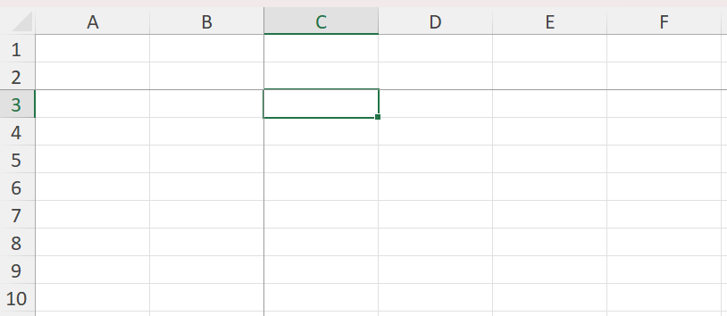
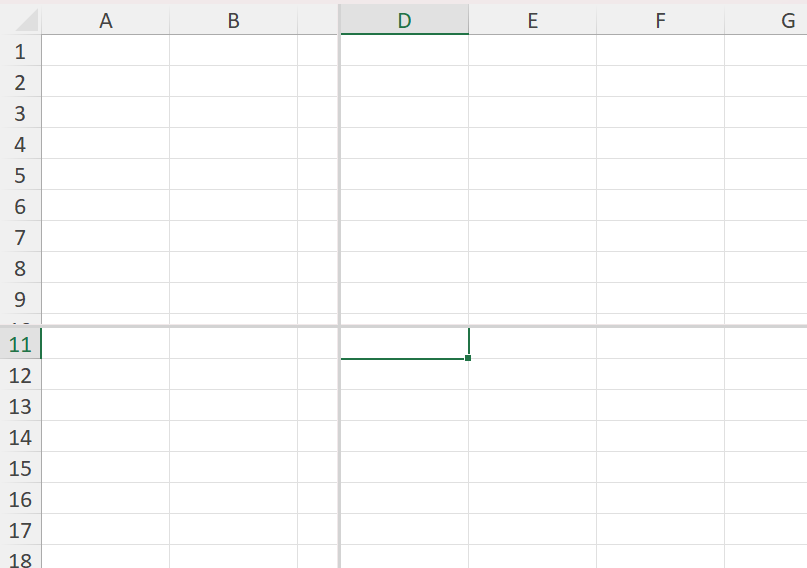

# Freeze and split panes

Worksheets may have one or more of their rows and/or columns frozen so they stay visible while
scrolling, or split into independently scrollable panes. XLSX.jl provides functions to freeze,
split, or remove panes from a worksheet's view.

## Freeze Panes

Freeze one or more rows (eg header rows) so that they will not scroll vertically with rows beneath 
and/or one or more columns (eg row labels) so they don't scroll sideways using `freezePanes()`. 
Frozen rows/columns remain fixed as the main pane scrolls freely.

```julia

julia> using XLSX

julia> f = XLSX.newxlsx()
XLSXFile("C:\...\blank.xlsx") containing 1 Worksheet
            sheetname size          range        
-------------------------------------------------
             Sheet1  1x1           A1:A1        

julia> sheet = f[1]
1×1 XLSX.Worksheet: ["Sheet1"](A1:A1) 

julia> XLSX.freezePanes(sheet) # freezes the first row (the default: nrows=1, ncols=0)

julia> XLSX.freezePanes(sheet; nrows=2, ncols=1) # freezes the first 2 rows and column A

julia> XLSX.freezePanes(sheet, "C3") # equivalent to nrows=2, ncols=2 (see image below)
```

`nrows`/`ncols` and `anchor_cell` are two ways of specifying the same boundary: `anchor_cell` is
the first cell of the scrolling region, so `freezePanes(s, "C3")` freezes everything above and to
the left of `C3`.

Frozen panes have no effect in XLSX.jl but can be set using `freezePanes()` so that the panes are 
frozen when a saved file is opened in Excel.



Calling `freezePanes` again replaces any panes already set with the newly 
specified panes.

## Split Panes

Split a worksheet into two or four panes that are separately and independently scrollable 
using `splitPanes()`. Unlike frozen panes, a split pane's divider can be dragged interactively 
by the user in Excel.

```julia

julia> XLSX.splitPanes(sheet; nrows=10) # splits the view below row 10, with a draggable divider

julia> XLSX.splitPanes(sheet, "D11") # Creates 4 scollable panes
```



Split panes have no effect in XLSX.jl but can be set using `splitPanes()` so that the panes are 
split when a saved file is opened in Excel.

!!! note

    The divider position is computed from actual column widths and row heights (falling back to
    worksheet and Excel defaults where none are set), so it lands close to the requested
    row/column boundary but isn't guaranteed to be pixel-exact for every font.

## SplitFreeze panes

The `splitFreeze()` function freezes panes just like `freezePanes()`, but marks them internally 
as having originated from a split (`state="frozenSplit"`), matching what Excel itself writes 
when a user freezes panes already created with a draggable split. For a freshly created pane the 
visible result is the same as `freezePanes`; the distinction only affects how Excel behaves if 
the pane is later unfrozen interactively.

```julia

julia> XLSX.splitFreeze(sheet; nrows=3, ncols=2)
```

## Remove panes

```julia

julia> XLSX.removePanes(sheet)
```

Removes any frozen or split panes, restoring a plain single-pane view.