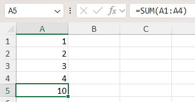
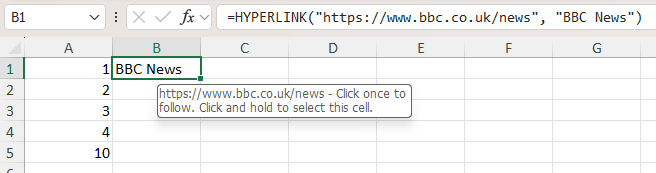
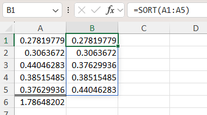
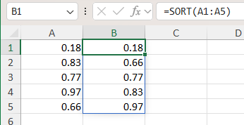
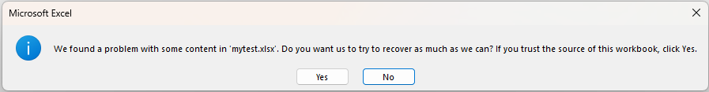
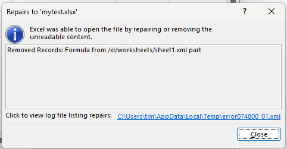

# Using Formulas

`XLSX.jl` provides two functions allowing direct access to cell formulas, [XLSX.getFormula](@ref) and [setFormula](@ref).

## Using a simple formula

Find the formula in a cell using the [XLSX.getFormula](@ref) function. This returns a string representation 
of the function used in the specified cell (e.g. `"=A1+B1"`). For most standard functions, this is the 
same as the representation of the same formula in the Excel formula bar (but see the section on Newer 
Functions (below) for exceptions).

Similarly, set a formula in a cell using the [setFormula](@ref) function, entering the function 
exactly as it would appear in the Excel formula bar.

To set a formula, it must be a valid Excel formula and written in US english with 
a comma separator. Cell references may be absolute or relative references in either 
the row or the column or both (e.g. `\$A\$2`). No validation of the specified 
formula is made by `XLSX.jl` and the formula wil be accepted as given.


For example:

```julia
julia> using XLSX

julia> f=newxlsx()
XLSXFile("blank.xlsx") containing 1 Worksheet
            sheetname size          range        
-------------------------------------------------
               Sheet1 1x1           A1:A1        

julia> s=f[1]
1×1 Worksheet: ["Sheet1"](A1:A1) 

julia> s[1:4, 1]=1:4
1:4

julia> setFormula(s, "A5", "=sum(A1:A4)") # function names are case insensitive. Excel converts them all to uppercase.
"=sum(A1:A4)"

julia> XLSX.getFormula(s, "A5")
"=sum(A1:A4)"
```



Special characters need escaping in the usual way, so that absolute references must be written as, 
for example, `\$A\$1`. Similarly, when entering text strings into formulas, quotation marks need 
to be quoted. For example:

```julia
julia> setFormula(s, "B1", "=hyperlink(\"https://www.bbc.co.uk/news\", \"BBC News\")")
"=hyperlink(\"https://www.bbc.co.uk/news\", \"BBC News\")"

julia> XLSX.getFormula(s, "B1")
"=hyperlink(\"https://www.bbc.co.uk/news\", \"BBC News\")"
```



Valid formulae of arbitrary complexity and degree of nesting are supported.

```julia
julia> setFormula(s, "B1", "=MID(A1, FIND(\"-\",A1)+1, FIND(\"-\",A1, FIND(\"-\",A1)))")
"=MID(A1, FIND(\"-\",A1)+1, FIND(\"-\",A1, FIND(\"-\",A1)))"

julia> setFormula(s, "B2", "AND(ROUNDDOWN(A1,0)-TODAY()>(7-WEEKDAY(TODAY())),ROUNDDOWN(A1,0)-TODAY()<(15-WEEKDAY(TODAY())))")
"AND(ROUNDDOWN(A1,0)-TODAY()>(7-WEEKDAY(TODAY())),ROUNDDOWN(A1,0)-TODAY()<(15-WEEKDAY(TODAY())))"
```

Since `XLSX.jl` does not and cannot replicate all the functions built in to Excel, 
setting a formula in a cell does not permit the cell's value to be re-calculated 
within `XLSX.jl`. Instead, although the formula is properly added to the cell, the 
value is set to `missing`. However, the saved `XLSXFile` is set to force Excel to 
re-calculate on opening.

```julia
julia> using XLSX

julia> f=newxlsx("setting formulas")
XLSXFile("blank.xlsx") containing 1 Worksheet
            sheetname size          range        
-------------------------------------------------
     setting formulas 1x1           A1:A1        


julia> s=f[1]
1×1 Worksheet: ["setting formulas"](A1:A1) 

julia> s["A2:A10"]=1
1

julia> s["A1:J1"]=1
1

julia> setFormula(s, "B2:J10", "=A2+B1") # adds formulae but cannot update calculated values

julia> s[:]
10×10 Matrix{Any}:
 1  1         1         1         1         1         1         1         1         1
 1   missing   missing   missing   missing   missing   missing   missing   missing   missing
 1   missing   missing   missing   missing   missing   missing   missing   missing   missing
 1   missing   missing   missing   missing   missing   missing   missing   missing   missing
 1   missing   missing   missing   missing   missing   missing   missing   missing   missing
 1   missing   missing   missing   missing   missing   missing   missing   missing   missing
 1   missing   missing   missing   missing   missing   missing   missing   missing   missing
 1   missing   missing   missing   missing   missing   missing   missing   missing   missing
 1   missing   missing   missing   missing   missing   missing   missing   missing   missing
 1   missing   missing   missing   missing   missing   missing   missing   missing   missing

# formulae are there for when the saved file is opened in Excel.
julia> XLSX.getcell(s, "B2")
XLSX.Cell(B2, "", "", "", XLSX.ReferencedFormula("=A2+B1", 0, "B2:J10", nothing))

julia> XLSX.getFormula(s, "B2")
"=A2+B1"

julia> XLSX.getcell(s, "J10")
XLSX.Cell(J10, "", "", "", XLSX.FormulaReference(0, nothing))

julia> XLSX.getFormula(s, "J10")
"=I10+J9"
```

## Referenced formulas

If a contiguous range is specfied, [setFormula](@ref) will usually create a 
`ReferencedFormula`. This is the same as Excel would use if using drag fill to 
copy a formula into a range of cells.

The first cell in the range (reference cell) contains the formula and the other 
cells in the range contain a reference to the reference cell. The formula 
returned by [XLSX.getFormula](@ref) will be adjusted appropriately to allow for the offset 
from the reference cell. This will match what is shown in the formula bar for 
this cell in Excel.

```julia
julia> s[1:4, 1]=1:4
1:4

julia> setFormula(s, "B1", "=A1")
"=A1"

julia> setFormula(s, "B2:B4", "=B1+A2") # creates a running total
"=B1+A2"

julia> XLSX.getcell(s, "B2")
XLSX.Cell(B2, "", "", "", "", XLSX.ReferencedFormula("=B1+A2", 0, "B2:B4", nothing)) # this is the reference cell. It has index 0.

julia> XLSX.getcell(s, "B4")
XLSX.Cell(B4, "", "", "", "", XLSX.FormulaReference(0, nothing)) # this refers to the reference cell with index 0

julia> XLSX.getFormula(s, "B2")
"=B1+A2"

julia> XLSX.getFormula(s, "B4") # returned formula is adjusted for offset
"=B3+A4"
```

Unlike with conventional functions, dynamic array functions (e.g. `SORT` or `UNIQUE`)
should not be put into a `ReferencedFormula` and neither should functions that refer to 
cells in other sheets. When functions of this type are identified, they will instead be 
duplicated individually in each cell in the given range (but with relative cell references 
appropriately adjusted). This is an internal process that should be transparent 
to the user.

## External references

An existing formula may contain references to cells in external workbooks, in the form
`[index]SheetName!A1` where `index` is an integer providing an internal Excel reference 
to the external workbook. [XLSX.getFormula](@ref) can be used to obtain the file name of the external 
reference using the keyword option `find_external_refs=true` to replace the index with the 
actual workbook path (as stored in the workbook's externalReferences).
By default, `find_external_refs=false` and the formula is returned unchanged.

```julia
julia> XLSX.getFormula(s, "B1")
"[1]Sheet1!\$A\$1"

julia> XLSX.getFormula(s, "B1"; find_external_refs=true)
"[https://d.docs.live.net/.../Documents/Julia/XLSX/linked-2.xlsx]Sheet1!\$A\$1"
```

It is not currently possible to use `setFormula` to create a formula that references a worksheet 
in an external file.

## Newer functions

Microsoft continues to add new functions to Excel with increasing complexity. Some of these are
not represented straightforwardly in the internal xml files using the representation shown in 
the formula bar like "traditional" formulas are. Instead, these need function prefixes when 
written to file. For example:

```julia
julia> s[1:5, 1]=rand(5)
5-element Vector{Float64}:
 0.2781977934853824
 0.3063671990614626
 0.44046282567557327
 0.38515484505427067
 0.37629936008012144

julia> setFormula(s, "A6", "sum(A1:A5)") # traditional function
"sum(A1:A5)"

julia> setFormula(s, "B1", "sort(A1:A5)") # needs a prefix. `setFormula` adds this transparently to the user.
"_xlfn.SORT(A1:A5)"

julia> setBorder(s, "A6";top=["style"=>"double"])
1

julia> writexlsx("mytest.xlsx", f, overwrite=true)
"C:\\Users\\...\\Julia\\XLSX\\mytest.xlsx"
```

The prefix is not shown by Excel in the formula bar, but it is needed in the internal xml file.
[setFormula](@ref) adds this prefix automatically. A dummy `ref` xml attribute is also created 
by [setFormula](@ref) and will be properly calculated on opening when Excel determines the spill range.



```
<c r="B1" cm="1">
  <f t="array" ref="B1:B1">_xlfn.SORT(A1:A5)</f> # prefix `_xlfn.` and `t` and `ref` attributes required by Excel
</c>

<c r="A6" s="1">
  <f>sum(A1:A5)</f> # simple representation as shown in the formula bar
</c>
```

The functions `GROUPBY` and `PIVOTBY` need an aggregation function as their 3rd/4th argument respectively. 
Currently only simple aggregator functions are supported (e.g. `SUM`, `AVERAGE`, `COUNT`, `COUNTA`, 
`MIN`, `MAX`, `MEDIAN`, `PRODUCT`, `STDEV`, `STDEVP`, `VAR` and `VARP`) by default (i.e. with `raw=false`).

More complex versions of theses functions and some of the other newer Excel functions are 
not easy to parse. For example, Excel's `LAMBDA` function is not well supported (in 
`GROUPBY`/`PIVOTBY` or otherwise). Moreover, as Microsoft adds more new functions in future that 
require a prefix or that generate a spill range (or both), [setFormula](@ref) may not recognise them 
automatically.

For these cases, a keyword option, `raw`, is provided (default=`false`), allowing the internal xml 
representation of a function (which may differ significantly from its representation in the formula 
bar) to be entered directly. This allows any arbitrary future function to be added using [setFormula](@ref). 
An additional keyword, `spill` (default=`nothing`), can be used to tell [setFormula](@ref) that the raw 
function will create a spill range (or to force it not to). The simplest way to determine the raw 
representation of any arbitrary function is to create it in Excel and then to inspect the resulting 
xml file. For example:

```julia
setFormula(f[1], "H21", "_xlfn.GROUPBY(E1:E151,A1:D151,_xlfn.LAMBDA(_xlpm.x,AVERAGE(_xlpm.x)),3,1)"; raw=true)
# setFormula recognises the `GROUPBY` function so, in this case, it is not necessary to specify `spill=true`

```

## Spill ranges

Some functions, such as `SORT` or `UNIQUE`, will return multiple values and Excel will "spill" these 
into a spill range the extent of which depends on the data on which the function is operating.
Generally, [setFormula](@ref) will handle this transparently and create a cell formula that spills when 
needed by adding an attribute `t="array"` to the cell in the internal xml file. For example

```julia
julia> s[1:5, 1]=rand(5)
5-element Vector{Float64}:
 0.1826020207094764
 0.8336742268414907
 0.773953482649498
 0.9739450126819114
 0.6627007761343171

julia> s[1:5, 2]="" # make sure these aren't EmptyCells so spill range can be formatted
""

julia> setFormula(s, "B1", "=sort(A1:A5)") # cell B1 contains the formula but the result spills down to B5
"=_xlfn.SORT(A1:A5)"

julia> setFormat(s, "A1:B5";format="Number")
-1
```



Even simple formulas can be made to spill in recent versions of Excel. For example, any cell 
given the formula `"=A1:A5"` would produce a 5-element result and would spill to fill 5 cells.

You may include a spill range in a formula using the base cell name with a `#` suffix, and 
this is treated as a reference to the full spill range. For example, to add an extra column 
to the above table, use `setFormula(s, "C1", "=2*B1#")` just as in Excel. The result will 
spill to fill cells `C1:C5`.

If a function Excel expects to return a spill range does not have attribute `t="array"` set, 
Excel will automatically create an "implicit intersection" when it opens the file by adding 
an `@` prefix to the function name. The @ symbol tells Excel to return a single 
value from a range or array, based on the context of the formula. For example, if a formula 
references a column of values but is entered in a single cell, Excel uses @ to pick the value 
from the same row as the formula.

For most formulas, [setFormula](@ref) will determine the correct attribute value for `t`. In cases 
where it doesn't (usually when using `raw=true`), it is possible to force the formula to indicate 
(to Excel) that it spills using the `spill=true` keyword option as described above. Similarly, in 
the unlikely event that [setFormula](@ref) might choose to create a spill function incorrectly, this can 
be prevented with `spill=false`.

Only rarely in complex, nested formulae involving cell range references, aggregator functions and/or 
dynamic array functions, and for any function that spills as a direct result of using a 
named cell range, should it be necessary to use the `raw` keyword option described above.

!!! note

    Excel is often very fussy about the internal structure of an xlsx file but the resulting
    error messages (when Excel tries to open a file it considers mal-formed) may be somewhat cryptic. 
    If there is an error in the formula you enter, it may not be clear what it is from the error 
    Excel produces (as shown below). A safe fall back may be to test the formula in Excel itself and copy/paste 
    it into julia. Alternatively, copy the formula directly from the xml representation of a working 
    Excel file and use the `raw=true` keyword option (and `spill=true` if the function used creates 
    a spill range).

    For example:

    ```julia

    julia> f=newxlsx()
    XLSXFile("blank.xlsx") containing 1 Worksheet
                sheetname size          range        
    -------------------------------------------------
                Sheet1 1x1           A1:A1        

    julia> f[1][1:3, 1]=collect(1:3)
    3-element Vector{Int64}:
    1
    2
    3

    julia> setFormula(f[1], "B1", "=max(A1:A3") # missing closing parenthesis in the formula
    ""

    julia> XLSX.getcell(f[1], "B1")
    XLSX.Cell(B1, "", "", "", "", XLSX.Formula("=max(A1:A3", "", "", nothing))

    julia> writexlsx("mytest.xlsx", f, overwrite=true)
    "C:\\Users\\...\\Julia\\XLSX\\mytest.xlsx"

    ```

    
    
